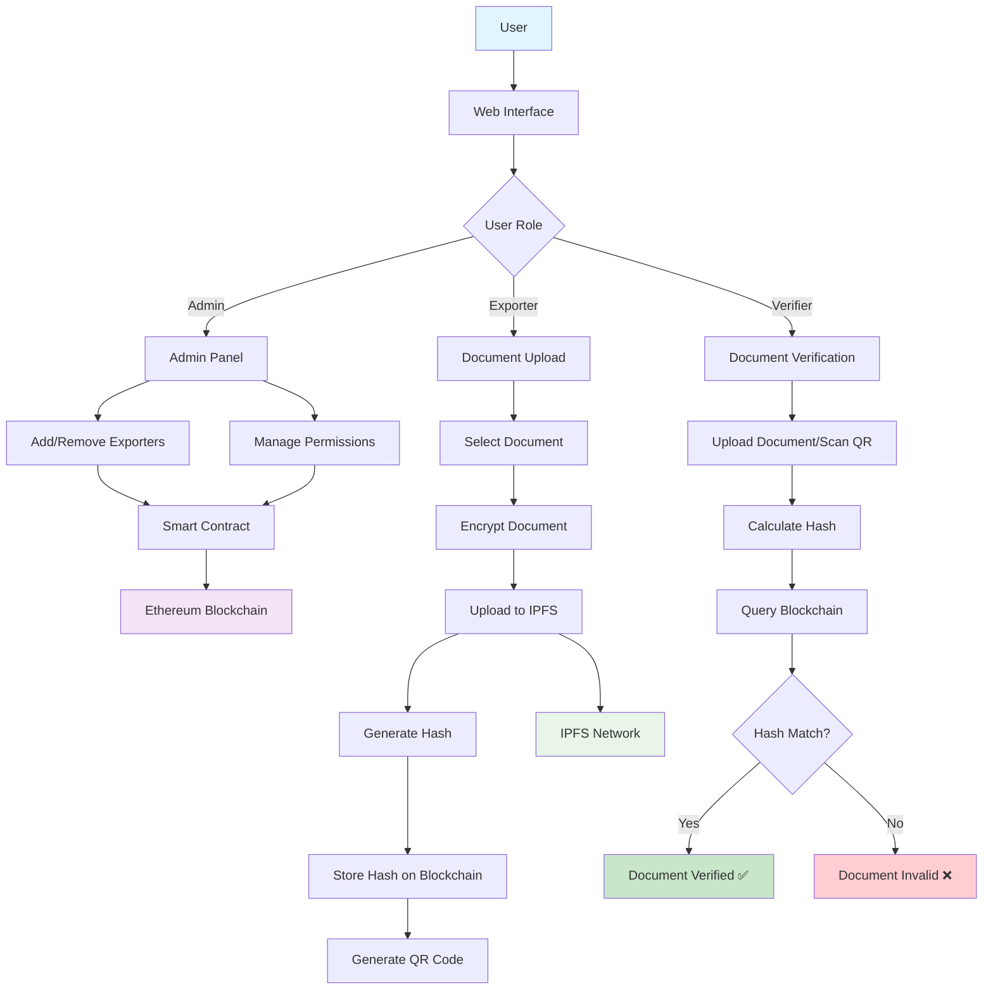
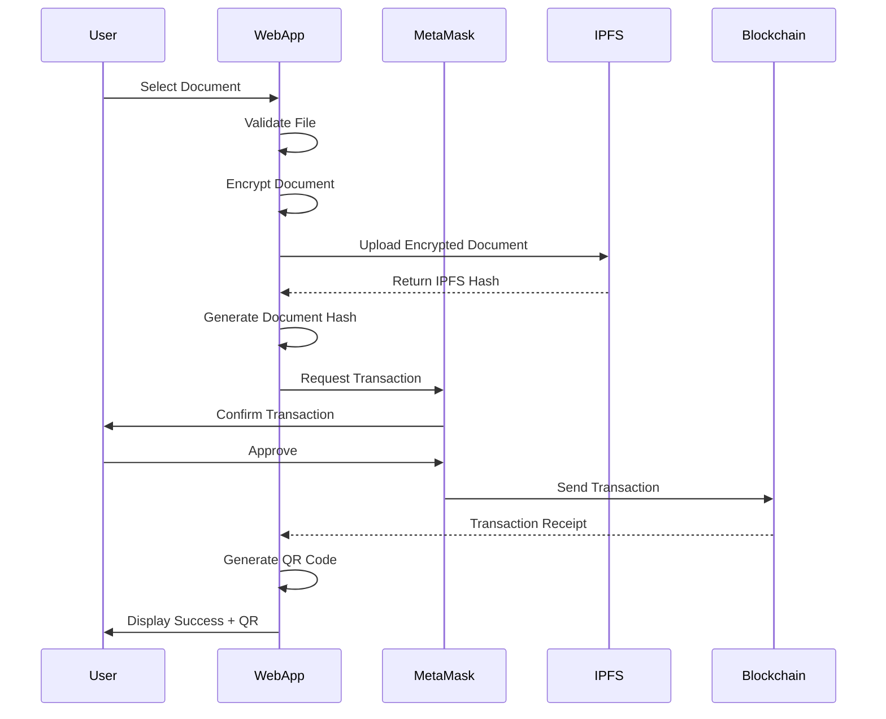
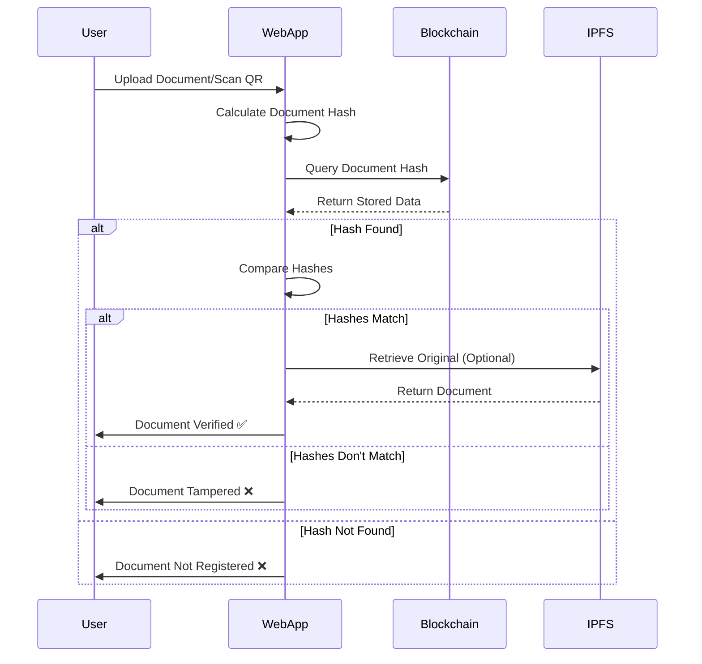
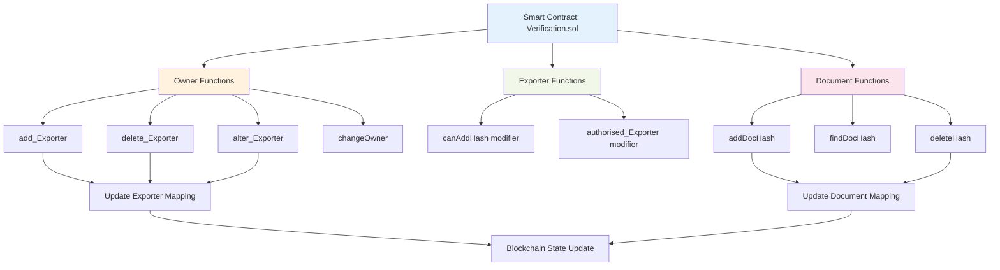
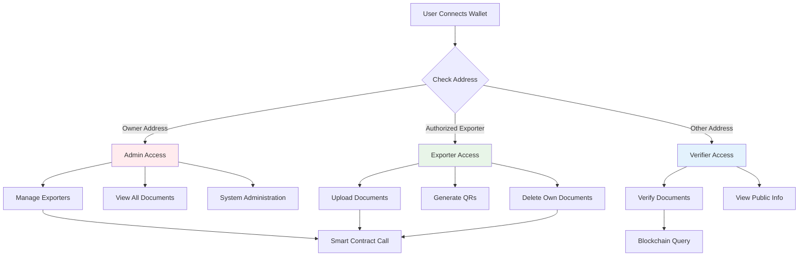
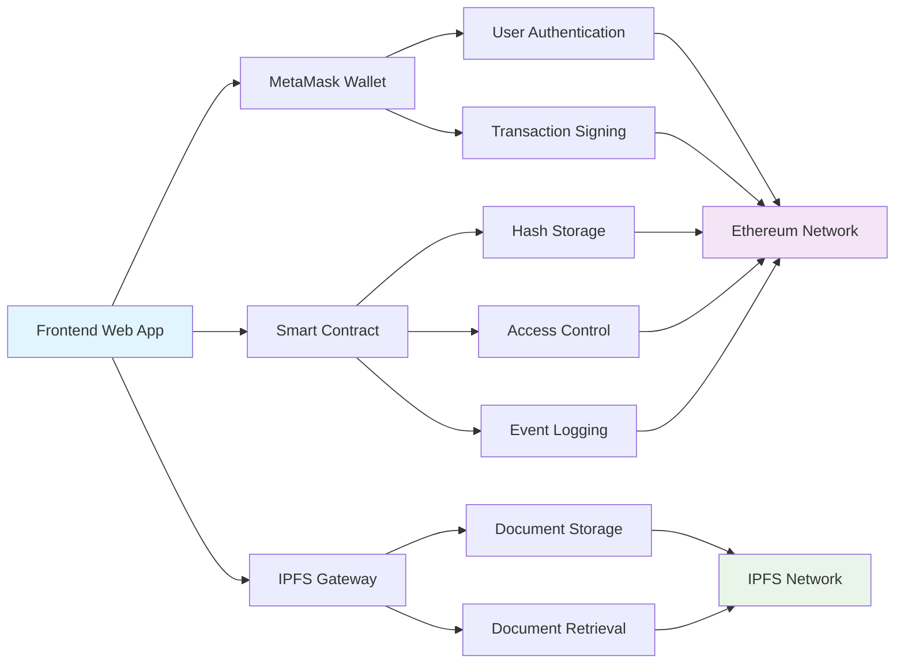
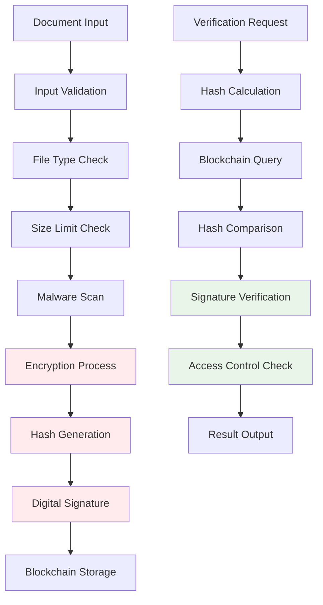
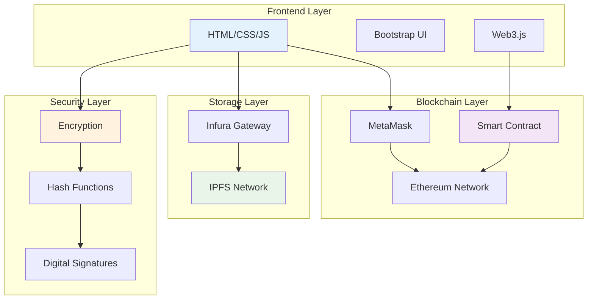

# Mermaid/Gamma Flowchart Code for Blockchain Document Verification

## 1. System Architecture Flowchart

## 2. Document Upload Process Flow

## 3. Document Verification Process Flow

## 4. Smart Contract Function Flow

## 5. User Role-Based Access Flow

## 6. Data Flow Architecture

## 7. Security Layer Flow

## 8. System Component Integration

## Usage Instructions:

1. Copy any of the above Mermaid code blocks
2. Paste them into:

   - Mermaid Live Editor (https://mermaid.live/)
   - GitHub README files
   - GitLab documentation
   - Notion pages
   - Any Mermaid-supported platform

3. The diagrams will render automatically as flowcharts
4. You can customize colors, styling, and layout as needed
