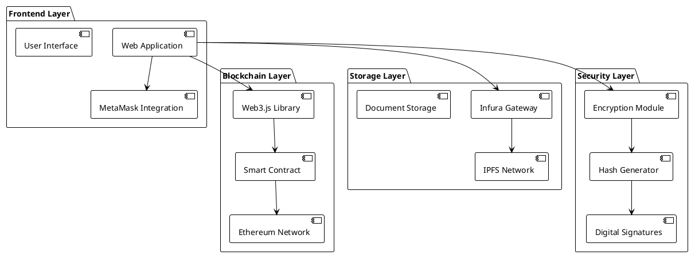
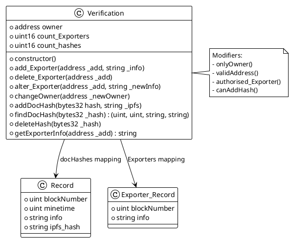
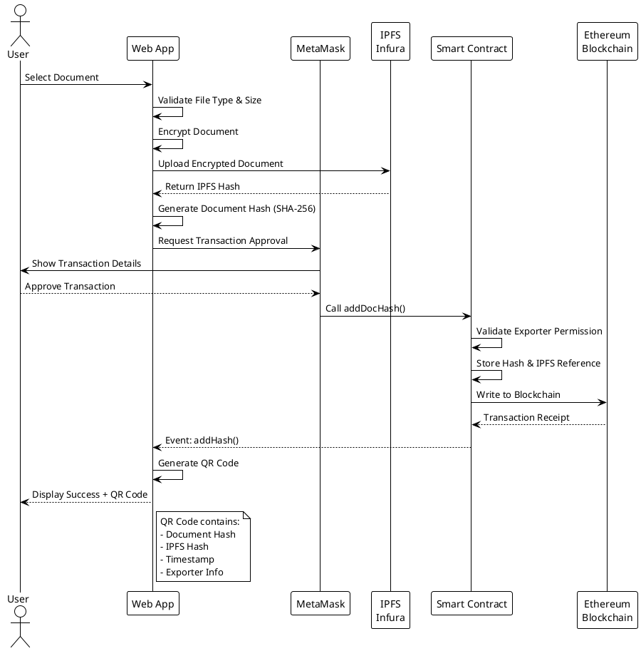
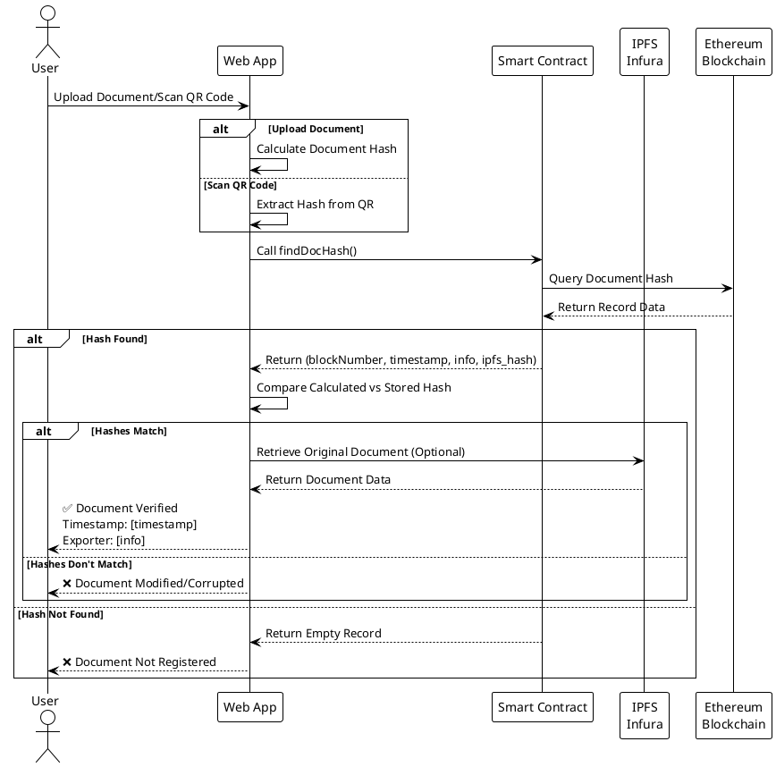
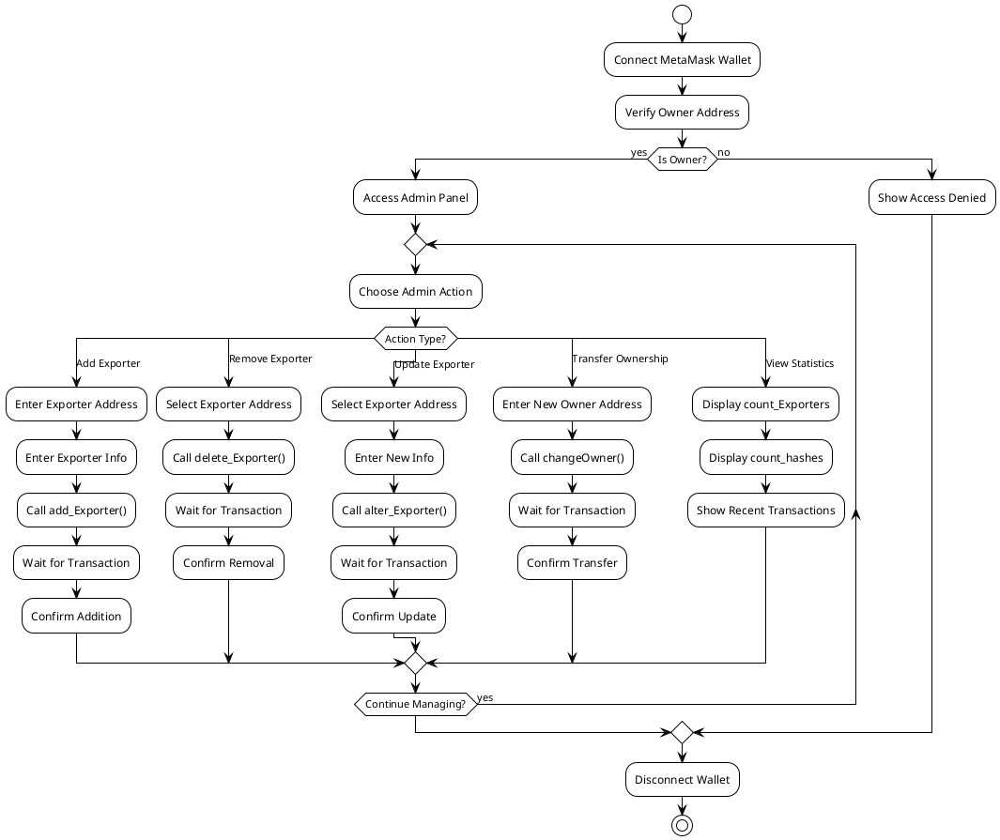
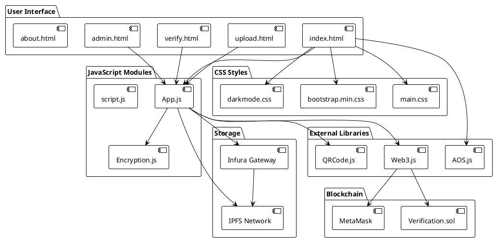
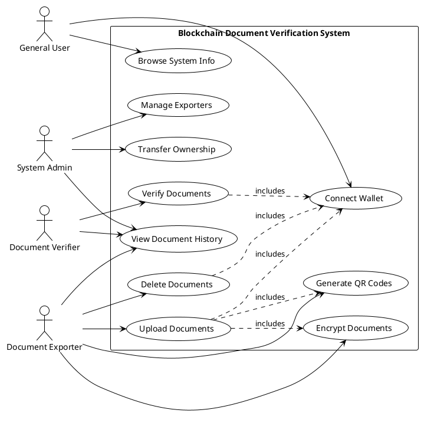
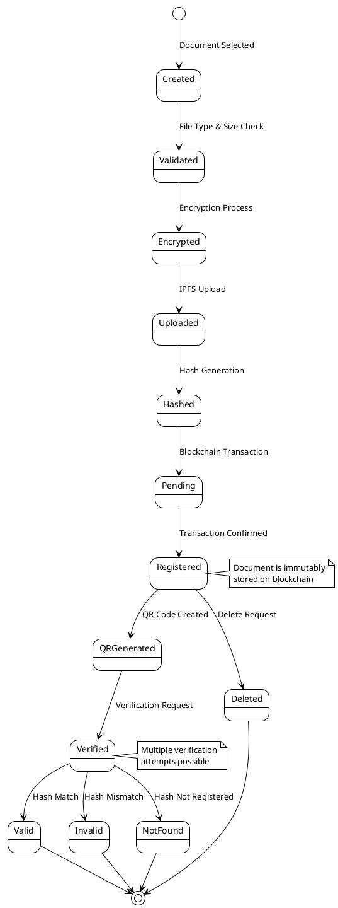
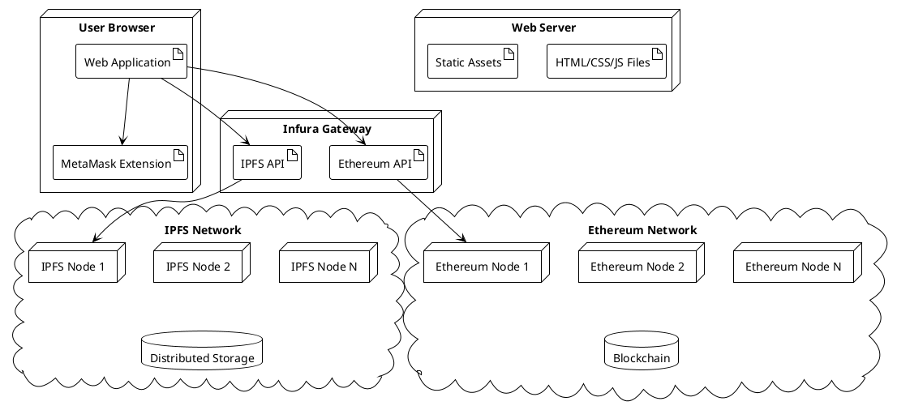
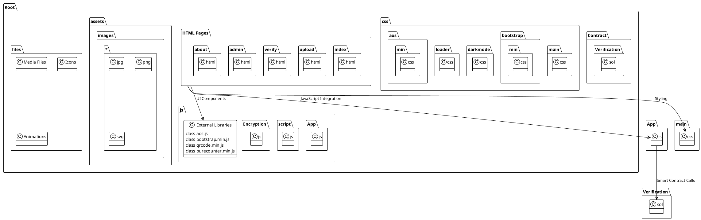

# PlantUML Code for Blockchain Document Verification System

## 1. System Architecture Diagram

## 2. Class Diagram - Smart Contract Structure

## 3. Sequence Diagram - Document Upload Process

## 4. Sequence Diagram - Document Verification Process

## 5. Activity Diagram - Admin Workflow

## 6. Component Diagram - System Components

## 7. Use Case Diagram

## 8. State Diagram - Document Lifecycle

## 9. Deployment Diagram

## 10. Package Diagram - Code Organization

## Usage Instructions:

1. **Copy any PlantUML code block**
2. **Paste into PlantUML editors:**

   - PlantUML Online Server (http://www.plantuml.com/plantuml)
   - VS Code PlantUML Extension
   - IntelliJ IDEA PlantUML plugin
   - Draw.io (supports PlantUML)

3. **Integration Options:**

   - GitHub/GitLab README files
   - Confluence pages
   - Documentation systems
   - Presentation slides

4. **Customization:**
   - Modify colors with `!theme` directive
   - Add/remove components as needed
   - Adjust layout and styling
   - Export as PNG, SVG, or PDF
